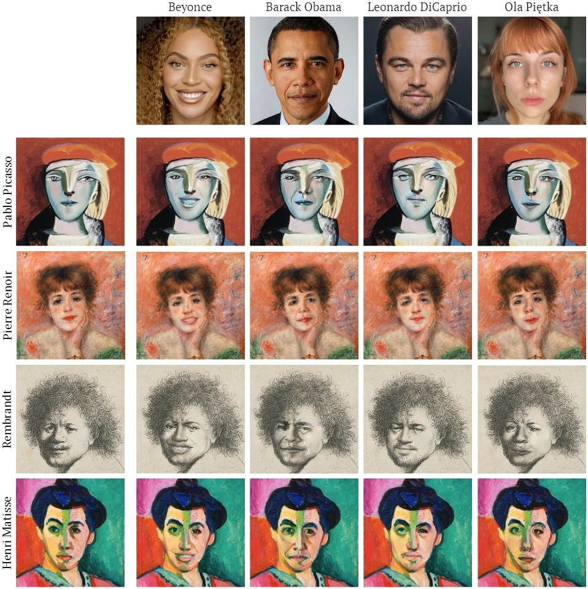
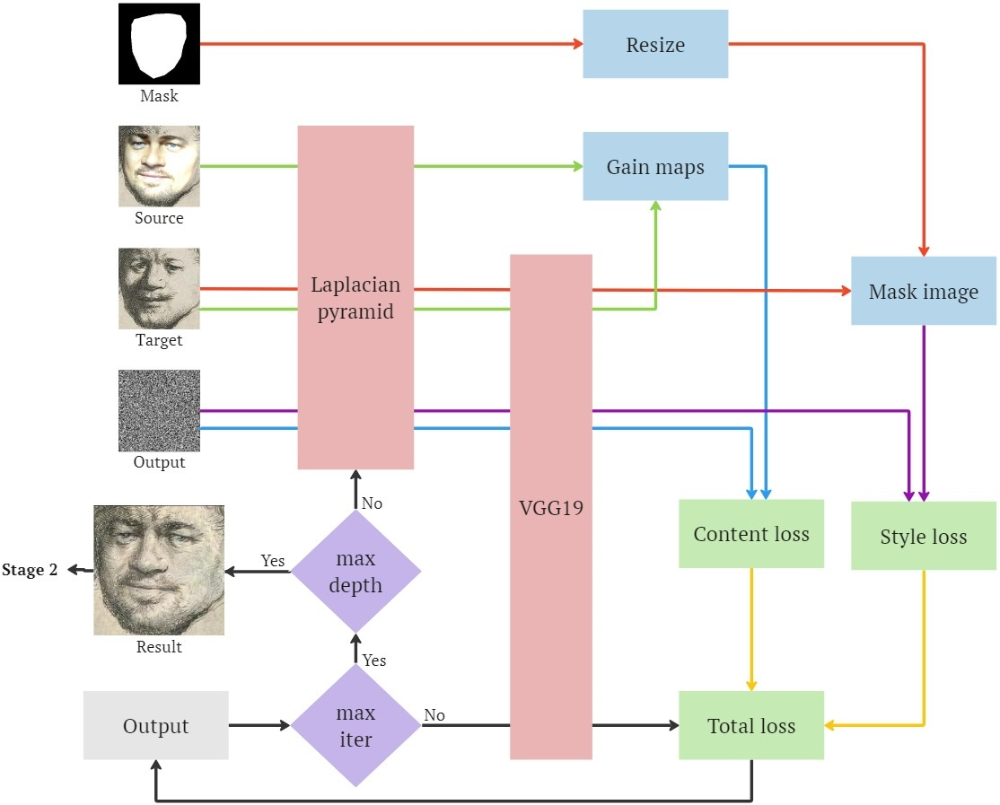
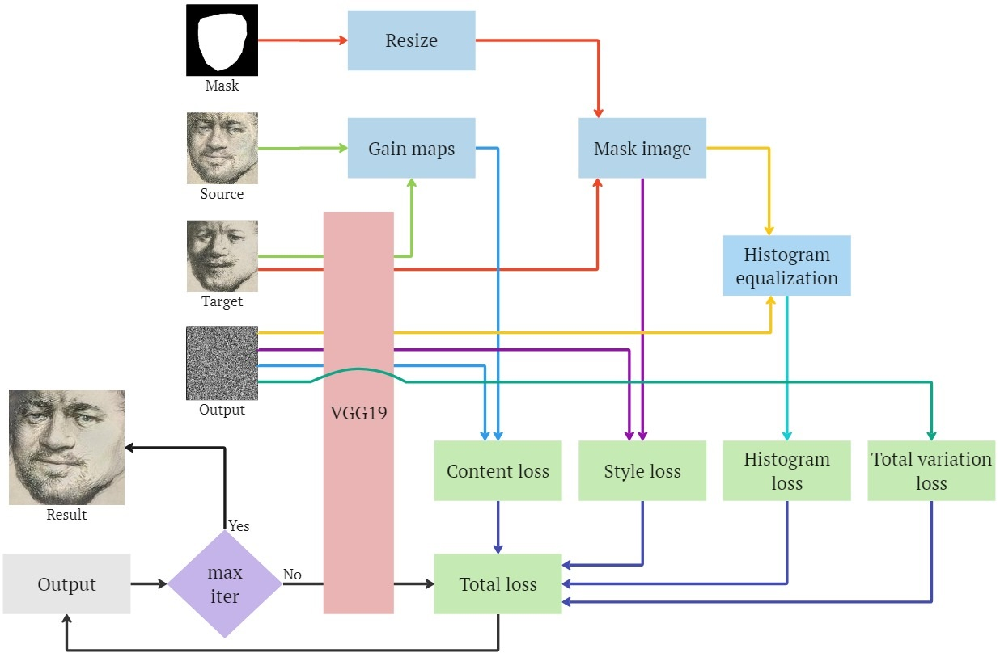

# Face Swapping & Style Transfer
This repository contains the code and detailed explanations of a project combining the art of portrait painting with the capabilities of computational photography. This unique venture utilizes deep learning techniques for face swapping and style transfer to transform portraits, illustrating the potential of AI in the realm of art and photography.




## Key Features
- **Facial Keypoint Detection**: Identifies crucial facial landmarks to guide the transformation and warping processes.

- **Triangulation & Affine Transforms**: Used to map and warp the input face to the structure of the face in the portrait.

- **Color Correction & Blending**: Ensures that the swapped face blends seamlessly with the original portrait.

- **Style Transfer**: Applies the artistic style from the portrait to the swapped face, maintaining the unique aesthetic characteristics of the original artwork.

## About Style Transfer Process
The Style Transfer process in this project is a unique two-stage process, focused on preserving the style and content characteristics of the original artwork while introducing the facial features of the provided image.

- **Stage 1**: The process begins by creating a Laplacian pyramid of the source, target (portrait), and the initial output images. At each level of the pyramid, we extract features using a pre-trained VGG19 network, and these features are used to minimize the loss at each level, which comprises both content and style losses. The output image from one pyramid level is upsampled and used as input for the next computation, with this process repeated across all pyramid levels.



- **Stage 2**: The second stage of the process is used to refine the image details. It utilizes the output from the first stage and introduces additional computations such as histogram loss and total variation loss, in addition to the content and style losses from Stage 1. This stage helps to correct any instabilities from Stage 1 and further enhances the overall image quality.



This innovative approach successfully balances the challenges of style transfer, ensuring that the final image retains the unique artistic style of the original portrait while incorporating the distinctive features of the input face image. This method brings a fresh perspective to the application of computational photography in the field of art and creates exciting possibilities for the fusion of traditional artistic techniques and modern AI-driven processes. 

To learn more about style transfer process see [project's documentation](https://github.com/OlaPietka/Portrait-Style-Tranfer/blob/main/Portrait%20Face%20Swap%20%26%20Style%20Transfer.pdf).

## Installation and Usage
The project is implemented in Python. To install necessary dependencies, run:
```
pip install -r requirements.txt
```

To use the code, you need to provide an image of a face, an image of a portrait, the path for the output image, and the path to predictor file (`shape_predictor_68_face_landmarks.dat`). The result will be an image that includes the swapped face in the style of the portrait.

```
python main.py --source_image <face_image_path> --target_image <portrait_image_path> --output_image <output_image_path> --predictor <predictor_file_path>
```

## References
A list of research papers and resources that this project is built upon can be found in the References section of the [project's documentation](https://github.com/OlaPietka/Portrait-Style-Tranfer/blob/main/Portrait%20Face%20Swap%20%26%20Style%20Transfer.pdf).
